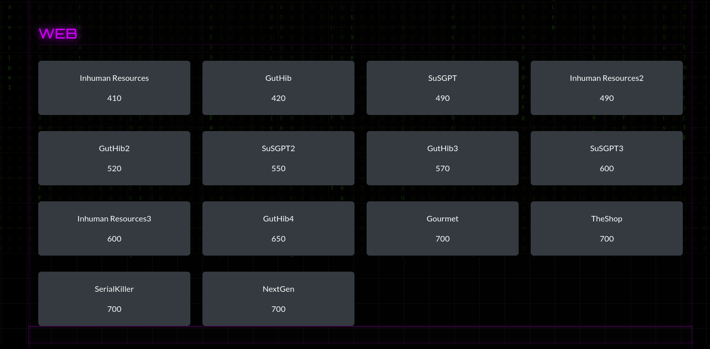
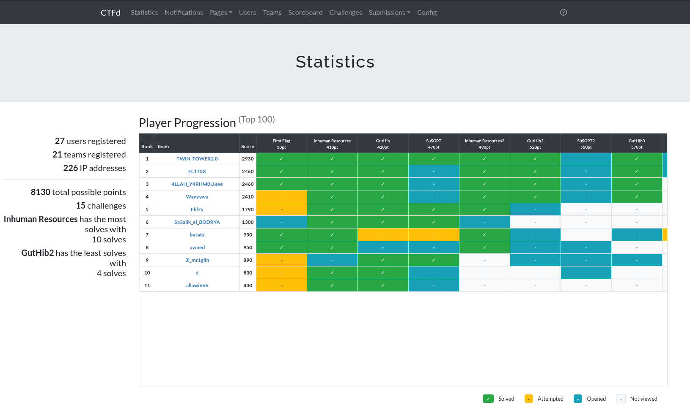

<div align="center">


# 🕸️ WebCTF — SecurinetsENIT 

**My contribution to the members-only SecurinetsENIT Web CTF, held on 13–14 December 2025.**  
**Authors : ASSADA x h1dr1**


<br>

[](.)
[](.)
[](.)


<br>


</div>


<br>

## Challenges Overview


| Series | Theme | Challenges | Stack |
|--------|-------|:----------:|-------|
| [🐙 GutHib](https://github.com/Beylessen1/WebCTF_SecurinetsENIT/tree/main/GutHib) | Git cloning service | `4` | PHP |
| [👥 Inhuman Resources](https://github.com/Beylessen1/WebCTF_SecurinetsENIT/tree/main/Inhuman_Resources) | Corporate HR system | `3` | Python / Flask / SQLite |
| [🤖 SuSGPT](https://github.com/Beylessen1/WebCTF_SecurinetsENIT/tree/main/SuSGPT) | AI chat interface | `3` | PHP |


<br>



## 📦 Challenge Categories
<br>

### 🐙 GutHib — *4 Levels*


A service that clones Git repositories. What could possibly go wrong? Each level introduces a new twist.

```
GutHib/
├── GutHib1/
├── GutHib2/
├── GutHib3/
└── GutHib4/
```

<br>

### 👥 Inhuman Resources — *3 Levels*


Eve, head of development, had a falling out with HR and quit, but not before leaving something behind. Navigate a corporate HR management system and uncover what she left. Each level raises the bar on how input is handled and validated.

```
Inhuman_Resources/
├── Inhuman_Resources1/
├── Inhuman_Resources2/
└── Inhuman_Resources3/
```

<br>

### 🤖 SuSGPT — *3 Levels*


Meet SuSGPT: a suspiciously familiar AI chat interface that accepts file uploads. Things are not always what they seem. Three levels, three layers of (mis)trust.

```
SuSGPT/
├── SuSGPT1/
├── SuSGPT2/
└── SuSGPT3/
```

<br>

## 🗂️ Repository Structure

```
WebCTF_SecurinetsENIT/
│
├── GutHib/
│   ├── GutHib1/
│   ├── GutHib2/
│   ├── GutHib3/
│   └── GutHib4/
│
├── Inhuman_Resources/
│   ├── Inhuman_Resources1/
│   ├── Inhuman_Resources2/
│   └── Inhuman_Resources3/
│
└── SuSGPT/
    ├── SuSGPT1/
    ├── SuSGPT2/
    └── SuSGPT3/
```

Each challenge folder contains:

- **Source code** 
- **Challenge brief** : a `.txt` file with the challenge name, flavor text, and scenario setup


<br>

## 🛠️ Tech Stack

<div align="center">

| Series | Language | Framework | Database |
|--------|----------|-----------|----------|
| GutHib |  | — | — |
| Inhuman Resources |  |  |  |
| SuSGPT |  | — | — |

</div>

<br>

## ▶️ How to Run a Challenge

Each challenge is self-contained and can be spun up locally.

**PHP challenges — GutHib & SuSGPT:**
```bash
cd GutHib/GutHib1/src
php -S localhost:8080
```

**Python / Flask challenges — Inhuman Resources:**
```bash
cd Inhuman_Resources/Inhuman_Resources1
pip install flask
python app.py
```

<br>

## 🏁 Flag Format

All flags follow the format:

```
SecurinetsENIT{...}
```

<br>
<br>
## 🔥 Player Progression



<br>

---

<div align="center">

## 👥 About

**SecurinetsENIT** is the cybersecurity club of the  
National Engineering School of Tunis (ENIT).


</div>
